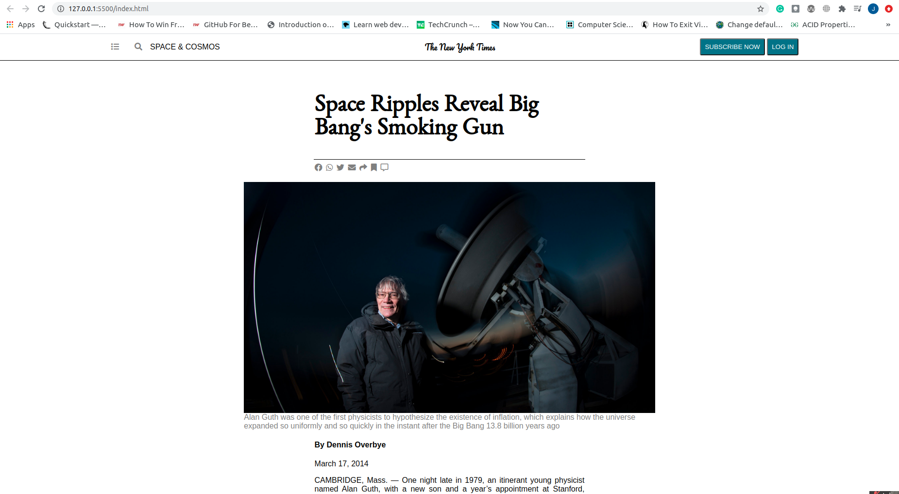

# New York Times Article Clone

> This is a practice project about an exciting article on Space Ripples Revealing the Big bang's Smoking Gun, the Inflation Theory.

Additional description about the project and its features.

## Built With

- HTML5 & CSS3
- No frameworks

## Live Demo

[Live Demo Link](https://livedemo.com)

## Getting Started

**This is an example of how you may give instructions on setting up your project locally.**
**Modify this file to match your project, remove sections that don't apply. For example: delete the testing section if the currect project doesn't require testing.**

To get a local copy up and running follow these simple example steps.

### Setup
- Download this GitHub Repo and go the index.html file

### Install
- Set up liveserver as an extension in your VS Code

### Usage
- Right click and open the index.html in your browser to view

## Authors

👤 **Author1**

- GitHub: [@KabohaJeanMark](https://github.com/KabohaJeanMark)
- Twitter: [@jean_quintus](https://twitter.com/jean_quintus)
- LinkedIn: [LinkedIn](https://www.linkedin.com/in/jean-mark-kaboha-software-engineer/)

## 🤝 Contributing

Contributions, issues, and feature requests are welcome!

Feel free to check the [issues page](issues/).

## Show your support

Give a ⭐️ if you like this project!

## Acknowledgments

- Hat tip to Microverse for the README template, instructions and tutoring
- Inspired by the Odin Project

## Inspirations
- Please check out the New York Times article [here](https://www.nytimes.com/2014/03/18/science/space/detection-of-waves-in-space-buttresses-landmark-theory-of-big-bang.html?_r=0)

## 📝 License

This project is [MIT](lic.url) licensed.